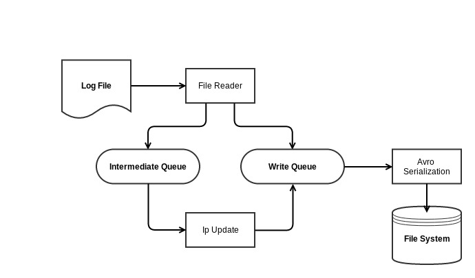

Access-Log-Parser
=================

Multithreaded access log parser with Avro Serialization.

##System Design



The file reader reads from the log file, parses it and places it in the intermediate queue, if the parse was successful. Otherwise the record is placed in the write queue.
The ip update task consumes log entries from the intermediate queue. For each log entry, it fetches the ip related details from a cache.
If the ip details are not available in cache, it makes a REST call to get the details and updates the cache as well as the log entry.
After updating the log entry, they are placed on the write queue. Log entries from the write queue are then serialized to the Avro file format and stored to disk


##Getting Started

1. Ensure that you have Java 1.8 and Maven 3.2 installed

2. Clone this repository

```
git clone https://github.com/dennyac/Access-Log-Parser.git
```

3. To start the access log parser, execute the following commands from the project base directory

  ```shell
  mvn package
  cd target
  java -cp accesslog-parser-0.0.1-SNAPSHOT-jar-with-dependencies.jar com.dennyac.accesslogparser.Driver input_file.log output_file.avro
  ```
